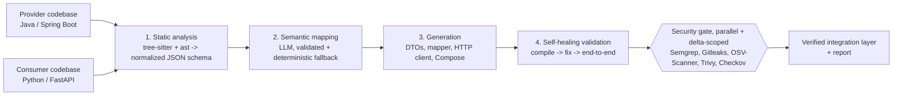

# AMS: Automated Microservice Synthesis

[](https://github.com/vansh2K5/ams-pipeline/actions/workflows/ci.yml)

**Point AMS at two backend codebases written by different teams, in different languages, with different names for the same data, and it generates the integration layer between them, then proves it works.**

```
$ ams run --provider examples/order-service --consumer examples/billing-service
[1/4] parsed order-service (java/spring-boot): 3 entities, 3 endpoints; billing-service (python/fastapi): 2 entities
[2/4] mapped Order -> OrderRecord with heuristic: 7 fields, coverage 100%
[3/4] generated ams_generated/order_service_client.py, docker-compose.ams.yml, requirements.txt
[4/4] compile ok after 1 heal round(s); end-to-end ok (14/14 field checks)
[sec] semgrep: ..., gitleaks: ..., osv-scanner: ..., trivy: ..., checkov: ...   (see the CI run)

PASS: report at ams-out/ams-report.md
```

## The problem

A Java order service says `customerId`, `totalAmount`, `createdAt`. A Python billing service wants `client_id`, `amount_due`, `placed_at`. Wiring them together means hand-writing DTOs, a mapper, an HTTP client with sane timeouts and retries, and Docker networking, then debugging the mismatches. It is repetitive, and naming/serialization mismatches are a classic source of production bugs.

## How it works

The core idea: **separate exact structure (parsers) from fuzzy meaning (LLM).** Parsers never hallucinate a field; the LLM is only asked the one question that needs judgment, over a small JSON view, and its answer is checked against the parsed schema.



| Phase | What it does |
|---|---|
| **1. Static analysis** | Java via the **tree-sitter** grammar (classes, records, enums, `@JsonProperty`, `@RestController` routes and `@PathVariable`/`@RequestParam`/`@RequestBody`); Python via the stdlib **`ast`** (Pydantic models, dataclasses, enums, FastAPI routes). Both emit the same language-agnostic schema, so adding a language is a parser change only. |
| **2. Semantic mapping** | With `ANTHROPIC_API_KEY` set, Claude proposes field pairs. Every pair is validated: unknown fields, duplicates and type clashes are rejected. A deterministic matcher (token split + synonym groups + type compatibility, one-to-one assignment) fills gaps, or does all of it with `--no-llm`. |
| **3. Generation** | Provider wire DTOs (Pydantic, provider JSON names as aliases, nested types in dependency order), a mapper into the consumer's own model, an `httpx` client per endpoint (pooled connections, connect/read timeouts, backoff retry on 502/503/504 and transport errors), a hardened `docker-compose` (private network, service DNS names, read-only, `no-new-privileges`) and a pinned requirements file. |
| **4. Self-healing validation** | Compile + Ruff (syntax and pyflakes). Ruff autofixes first; remaining diagnostics go to the LLM with the exact errors as context, for up to 3 rounds. Then a **mock provider built from the parsed schema** serves realistic payloads, the generated client runs against it in a separate process, and every mapped field is compared value by value. |
| **Security gate** | Five scanners run **in parallel** over only the generated delta. A scanner that is not installed is reported as *skipped*, never as clean. |

## Quick start

```bash
python -m venv .venv && . .venv/bin/activate      # Windows: .venv\Scripts\activate
pip install -e ".[dev,llm]"

ams run --provider examples/order-service --consumer examples/billing-service --no-llm
export ANTHROPIC_API_KEY=...                        # optional: LLM mapping + LLM repair
ams run --provider examples/order-service --consumer examples/billing-service
```

Other commands: `ams parse <service>` (Phase 1 schema as JSON), `ams map --provider ... --consumer ...` (mapping plan), `ams scan <dir>` (security gate only). `--pair Order:OrderRecord` forces the entity pair; `--apply` copies the verified layer into the consumer.

## Output

`ams-out/` holds the generated code, `schemas/*.json`, `mapping.json` and `ams-report.md` / `.json` (mapping with confidence and source per field, heal rounds, end-to-end checks, scanner results). CI publishes the report to the job summary on every push.

## Tests

`pytest` covers the parsers (records, `@JsonIgnore`, statics, aliases, nested lists), the mapper (including rejection of hallucinated and type-clashing LLM pairs), the heal loop (Ruff fix, unfixable reporting, LLM repair) and the full pipeline, including a test that corrupts one generated mapping and asserts the end-to-end check pinpoints exactly that field.

## Scope and roadmap

This is a working MVP, not the whole vision:

- **Now:** Java/Spring Boot and Python/FastAPI parsing; generation targets Python consumers; end-to-end verification against a schema-driven mock of the provider.
- **Next:** Java consumer generation (JavaPoet), Go and TypeScript parsers via tree-sitter, running both real services in Docker for the end-to-end stage, and LibCST-based injection into existing consumer modules.

## License

MIT
