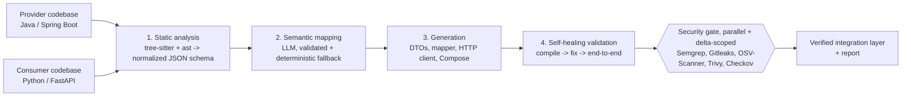

# AMS: Automated Microservice Synthesis

[](https://github.com/vansh2K5/ams-pipeline/actions/workflows/ci.yml) · **[Live report from the latest CI run](https://vansh2k5.github.io/ams-pipeline/)**

**Point AMS at two backend codebases written by different teams, in different languages, with different names for the same data, and it generates the integration layer between them, then proves it works.**

```
$ ams run --provider examples/order-service --consumer examples/billing-service
[1/4] parsed order-service (java/spring-boot): 3 entities, 3 endpoints; billing-service (python/fastapi): 2 entities
[2/4] mapped Order -> OrderRecord with heuristic: 7 fields, coverage 100%
[3/4] generated ams_generated/order_service_client.py, docker-compose.ams.yml, requirements.txt
[4/4] compile ok after 1 heal round(s); end-to-end ok (14/14 field checks)
[sec] semgrep: clean, gitleaks: clean, osv-scanner: clean, trivy: clean, checkov: skipped

PASS: report at ams-out/ams-report.html
```

## The problem

A Java order service says `customerId`, `totalAmount`, `createdAt`. A Python billing service wants `client_id`, `amount_due`, `placed_at`. Wiring them together means hand-writing DTOs, a mapper, an HTTP client with sane timeouts and retries, and Docker networking, then debugging the mismatches. It is repetitive, and naming/serialization mismatches are a classic source of production bugs.

## How it works

The core idea: **separate exact structure (parsers) from fuzzy meaning (LLM).** Parsers never hallucinate a field; the LLM is only asked the one question that needs judgment, over a small JSON view, and its answer is checked against the parsed schema.



| Phase | What it does |
|---|---|
| **1. Static analysis** | Java via the **tree-sitter** grammar (classes, records, enums, `@JsonProperty`, `@RestController` routes and `@PathVariable`/`@RequestParam`/`@RequestBody`); Python via the stdlib **`ast`** (Pydantic models, dataclasses, enums, FastAPI routes). Both emit the same language-agnostic schema, so adding a language is a parser change only. |
| **2. Semantic mapping** | With a Gemini, Groq or Claude key set, the LLM proposes field pairs. Every pair is validated: unknown fields, duplicates and type clashes are rejected. A deterministic matcher (token split + synonym groups + type compatibility, one-to-one assignment) fills gaps, or does all of it with `--no-llm`. |
| **3. Generation** | Provider wire DTOs (Pydantic, provider JSON names as aliases, nested types in dependency order), a mapper into the consumer's own model, an `httpx` client per endpoint (pooled connections, connect/read timeouts, backoff retry on 502/503/504 and transport errors), a hardened `docker-compose` (private network, service DNS names, read-only, `no-new-privileges`) and a pinned requirements file. |
| **4. Self-healing validation** | Compile + Ruff (syntax and pyflakes). Ruff autofixes first; remaining diagnostics go to the LLM with the exact errors as context, for up to 3 rounds. A repair that compiles can still be wrong (in testing, a model "fixed" an undefined name by reusing an unrelated field), which is why the end-to-end value checks run after the heal loop instead of trusting it. Then a **mock provider built from the parsed schema** serves realistic payloads, the generated client runs against it in a separate process, and every mapped field is compared value by value. |
| **Security gate** | Five scanners run **in parallel** over only the generated delta. A scanner only counts as *clean* if it actually examined something: not installed or nothing in scope is *skipped* with the reason, and empty or unreadable output is an *error* that fails the gate. The generated `requirements.txt` pins the full transitive dependency tree the layer was tested with, so OSV-Scanner and Trivy check exactly what shipped. |

## Quick start

```bash
python -m venv .venv && . .venv/bin/activate      # Windows: .venv\Scripts\activate
pip install -e ".[dev]"

ams run --provider examples/order-service --consumer examples/billing-service --no-llm

cp .env.example .env                                # add a GEMINI/GOOGLE, GROQ or ANTHROPIC key (gitignored)
ams llm                                             # checks the key with a live call
ams run --provider examples/order-service --consumer examples/billing-service
```

Other commands: `ams parse <service>` (Phase 1 schema as JSON), `ams map --provider ... --consumer ...` (mapping plan), `ams scan <dir>` (security gate only), `ams report [out-dir] --open` (rebuild and open the HTML report). `--pair Order:OrderRecord` forces the entity pair; `--apply` copies the verified layer into the consumer.

## LLM providers

| Provider | Key (env or `.env`) | Default model |
|---|---|---|
| Gemini | `GEMINI_API_KEY` or `GOOGLE_API_KEY` | `gemini-flash-latest` |
| Groq | `GROQ_API_KEY` | `openai/gpt-oss-120b` |
| Claude | `ANTHROPIC_API_KEY` | `claude-sonnet-5-5` |

AMS uses the first key it finds in that order; `AMS_LLM_PROVIDER` picks one explicitly and `AMS_MODEL` overrides the model. Calls go over plain HTTPS (no vendor SDKs), retry with backoff on 429/5xx (honouring `Retry-After`), never retry auth errors, and never let a provider failure crash a run: the deterministic matcher takes over, and the report credits the engine that actually produced each pair, e.g. `heuristic (fallback from gemini:gemini-flash-latest)` with the provider's error in the notes.

## Reports

Every run writes three reports to `ams-out/`:

| File | For |
|---|---|
| `ams-report.html` | People. A self-contained page (no external assets, light and dark): verdict, a **"Why it failed"** list in plain language, coverage / check / scanner tiles, per-phase timings, the field mapping with source types and confidence, every end-to-end check with expected vs actual, each scanner's status and findings (advisory or rule id + location), and both parsed services. |
| `ams-report.md` | CI. Posted to the GitHub Actions job summary on every run. |
| `ams-report.json` | Machines. The full result, including both parsed schemas. |

`ams report [out-dir] [--open]` rebuilds the Markdown and HTML from the JSON, so a report downloaded from a CI artifact can be re-rendered locally. On `main`, CI also publishes the HTML report to [GitHub Pages](https://vansh2k5.github.io/ams-pipeline/).

The output directory also holds the generated code, `schemas/*.json` and `mapping.json`.

## Tests

`pytest` covers the parsers (records, `@JsonIgnore`, statics, aliases, nested lists), the mapper (including rejection of hallucinated and type-clashing LLM pairs), the heal loop (Ruff fix, unfixable reporting, LLM repair) and the full pipeline, including a test that corrupts one generated mapping and asserts the end-to-end check pinpoints exactly that field.

## Scope and roadmap

This is a working MVP, not the whole vision:

- **Now:** Java/Spring Boot and Python/FastAPI parsing; generation targets Python consumers; end-to-end verification against a schema-driven mock of the provider.
- **Next:** Java consumer generation (JavaPoet), Go and TypeScript parsers via tree-sitter, running both real services in Docker for the end-to-end stage, and LibCST-based injection into existing consumer modules.

## License

MIT
